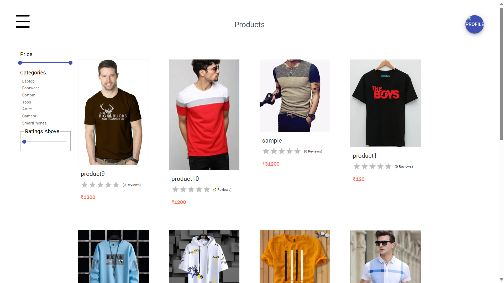

Name: VIVEK PRADHAN.

Company: CODETECH IT SOLUTIONS

ID: CT04DS7463

Domain: WEB DEVELOPMENT

Duration: August to September 2024

## Overview of the Project

### Project: E-COMMERCE WEBSITE (Task - 2)

### Objective

To develop a fully functional e-commerce platform that allows users to browse products, add items to their cart, make secure purchases, and manage their orders. The platform provides a seamless shopping experience with user accounts, product search, sorting and filtering features, and a secure payment gateway.

### Key Activities

- User Authentication: Implemented secure user registration and login using JWT for token-based authentication.
- Product Management: Designed features to allow users to browse, search, filter, and sort products based on categories, price, and ratings.
- Shopping Cart: Developed an intuitive cart system where users can add, remove, and update product quantities before checkout.
- Order Management: Enabled users to track and manage their orders, including payment status, shipping, and history.
- Payment Integration: Integrated Stripe for secure and seamless payment processing.
- Admin Dashboard: Created an admin interface for managing products, orders, users, and inventory.
- Email Notifications: Set up Nodemailer for transactional emails such as order confirmation and password recovery.

### Technologies Used

- Frontend: React.js, Redux, React Router DOM, React-Toastify for notifications
- Backend: Node.js, Express.js, MongoDB, bcryptjs for password encryption, JWT for authentication
- Storage: Cloudinary for image storage and management
- Payment Gateway: Stripe for handling secure transactions
- Email: Nodemailer for email services
- State Management: Redux for efficient state handling across the application

### Key Insights

- Scalability: Implementing Redux and structured API routes allowed for scalability and efficient state management.
- Security: Bcryptjs and JWT played a key role in ensuring user data security, especially in handling sensitive information like passwords and tokens.
- User Experience: Features like product search, sorting, and filtering were crucial to improve user navigation and overall experience.
- Payment Security: Integrating Stripe ensured secure payments, building user trust in the transaction process.
- Real-time Notifications: Using React-Toastify and Nodemailer for email notifications enhanced user engagement and interaction.
